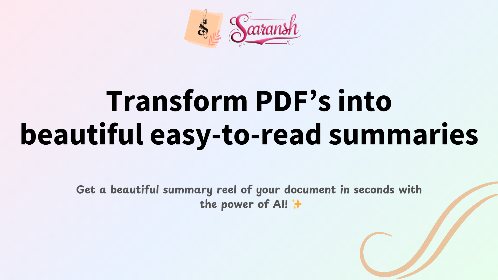

# Saaransh - Transform PDFs into an easy-to-read breautiful reel of impactful summaries with the power of AI!

- [🌏Visit to Saaransh](https://saaransh-ai.vercel.app/)

### Built with Next.js 15 App Router, Clerk for Authentication, React 19, OpenAI GPT-4, Langchain, ShadcN UI Components, Tailwind CSS 4, NeonDB, UploadThing, Cashfree for payments, Typescript, TailwindCSS and more.

---

## Table Of Contents:

- [Features](#-features)
  - [Core technologies I used](#-core-technologies)
  - [Application Features](#-application-features)
- [Visual Captures](#-screenshots)
- [Getting Started](#-getting-started)
- [Fork & Clone Repo](#-how-to-fork-and-clone)
- [Acknowledgements](#-acknowledgements)
- [License](#-license)

---

## ⚡ Features:

### 🪢 Core Technologies:

- 🚀 **Next.js 15 App Router** - Server-side rendering, routing, and API endpoints with Server Components.
- ❄️ **React** - Interactive user interfaces with reusable components.
- 🔑 **Clerk** - Secure authentication with Passkeys, GitHub, and Google Sign-in.
- 🤖 **GPT-4** - AI-powered summarization with contextual understanding and emoji-enhanced output.
- 📄 **Langchain** - PDF parsing, text extraction, and document chunking.
- 🎨 **ShadCN UI** - Accessible, customizable React components.
- 🗄️ **NeonDB (PostgreSQL)** - Serverless database for summaries and user data.
- 📤 **UploadThing** - Secure PDF uploads (up to 32MB) and file management.
- 💳 **Cashfree** - Secure and ease payment processing.
- 🛠 **TypeScript** - Static typing for enhanced development experience.
- 🎨 **TailwindCSS 4** - Utility-first, responsive styling.

### 💫 Application Features

- 📝 **Clear, structured summaries** with key points and insights.
- 🎨 **Beautiful, interactive summary viewer** with progress tracking.
- 🔒 **Secure file handling** and processing.
- 🔐 **Protected routes and API endpoints** for authentication and security.
- 💲 **Flexible pricing plans** (Basic and Pro).
- 📩 **Webhook implementation** to store the clerk user to our own database.
- 🖥️ **User dashboard** for managing summaries.
- 📱 **Responsive design** for mobile and desktop.
- 🔄 **Real-time updates** and path revalidation.
- 🚀 **Production-ready deployment**.
- 🔔 **Toast notifications** for upload status, processing updates, and error handling.
- ⚡ **Performance optimizations**.
- 🌎 **SEO-friendly** summary generation.

---

## 📸 Screenshots

Here are some previews of the application:

- A beautiful minimalistic landing page

  - 

- Cool looking pricing cards to buy plans

  - 

- A simple UI to upload PDFs

  - 

- Beautiful dashboard to view all of the summaries

  - 

- A single summary id page to read AI generated summary
  - 

---

## 🛠 Getting Started

To get started with this project:

1. **Fork the repository**.
2. **Add .env file to your project**:

   > Take reference from **env_example.txt**

3. **Create the required credentials**:
   - OpenAI API key
   - Clerk authentication setup
   - UploadThing configuration
   - Cashfree payment setup
   - NeonDB database connection

---

## 🌱 How to Fork and Clone

1. Click the "Fork" button in the top right corner of this repository to create your own copy
2. Clone your forked repository to your local machine
3. Install dependencies with `npm install`
   - If not work for some dependencies, use `npm install <name> --force` or `npm install <name> --legacy-peer-deps`
4. Set up your environment variables
5. Run the development server with `npm run dev`

---

## 🙏 Acknowledgements

- [Clerk](https://go.clerk.com/5q0WrFA) for authentication
- [OpenAI](https://openai.com) for GPT-4 API
- [Langchain](https://js.langchain.com) for document processing
- [ShadCN UI](https://ui.shadcn.com/) for components

---

## 📜 License

[MIT LICENSE](LICENSE)
